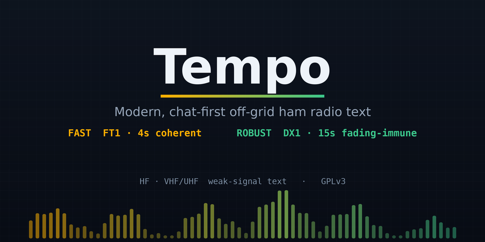
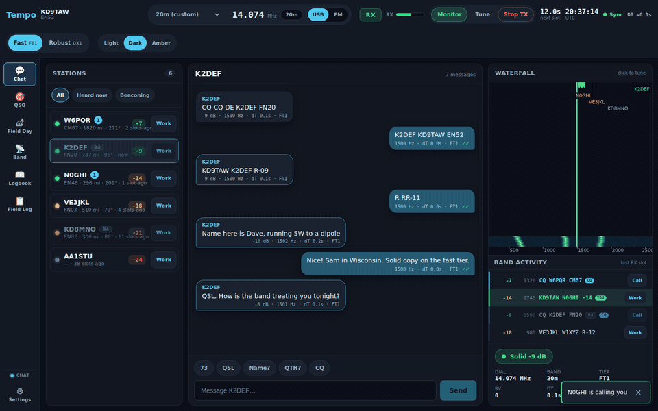
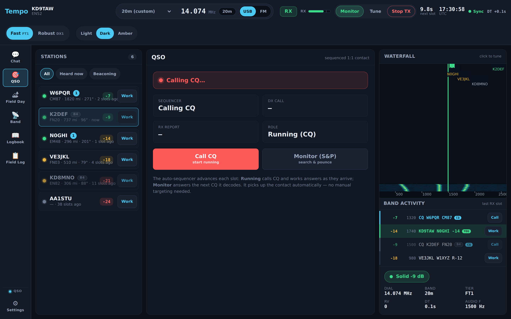
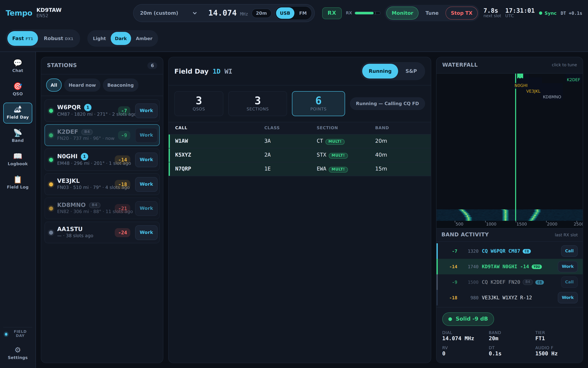
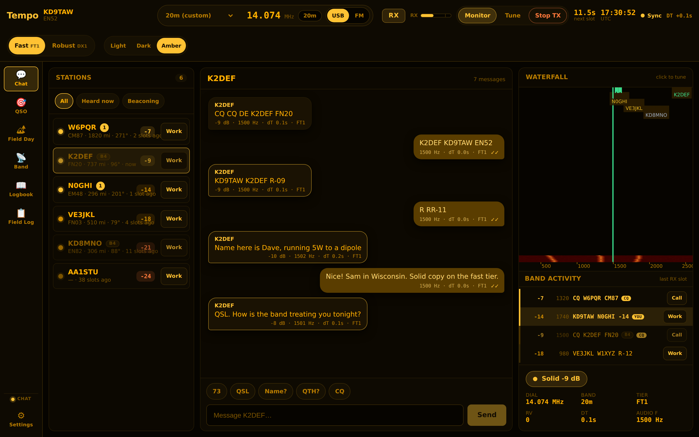
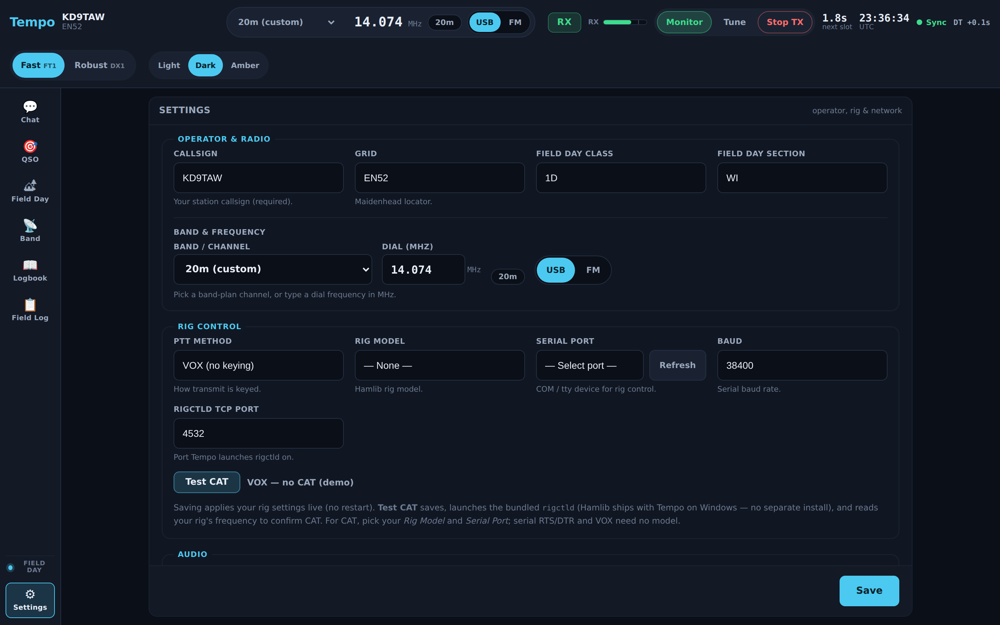

<div align="center">



**A modern, chat-first HF/VHF/UHF text-messaging app for the off-grid / preparedness ham community.**

[](COPYING)

[](https://github.com/kd9taw/tempo/actions/workflows/ci.yml)
[](https://github.com/kd9taw/tempo/releases)
[](https://github.com/kd9taw/tempo/releases)
-orange)

[](https://github.com/kd9taw/tempo/releases/latest)
[](docs/manual/)

<sub>**Download** is a ~199 MB offline installer (bundles WebView2 + Hamlib; no internet/admin needed). · **[Operator manual](docs/manual/)** — setup, operating, rig/audio, FAQ, troubleshooting. · Beta, simulation-validated.</sub>

</div>

Tempo wraps the **FT1** weak-signal waveform — and a new non-coherent **DX1** mode — as a
headless Fortran→C modem library (`libft1`) behind a clean **Rust core + Tauri web UI**. It
delivers fast conversational two-way text, fading-resilient national reach, presence/heartbeat,
store-and-forward relay, and a one-click ARRL **Field Day** exchange — in a single-window,
ham-aware interface that deliberately diverges from the dated, multi-window feel of
WSJT-X / JTDX / JS8Call (without hiding the radio).

> **Status — honest version.** The application is feature-complete and runs on Windows. The
> FT1 and DX1 waveforms are **validated by simulation** (AWGN + fading sweeps), **not yet by
> on-air operation** — that's the remaining gate. The FT8/FT4 tier is Phase 2. See
> [Status & roadmap](#status--roadmap), and [help validate it on the air](#help-validate-tempo).

<div align="center">



<sub>Tempo in motion — scrolling waterfall, arriving decodes, and the always-visible <b>Fast (FT1) ↔ Robust (DX1)</b> tier toggle (simulated data).</sub>

</div>

## See it

<table>
  <tr>
    <td width="50%"></td>
    <td width="50%"></td>
  </tr>
  <tr>
    <td align="center"><sub><b>QSO</b> — auto-sequenced 1:1 contacts (Run / Search&amp;Pounce)</sub></td>
    <td align="center"><sub><b>Field Day</b> — rate workspace, dupe-checked log, section multipliers</sub></td>
  </tr>
  <tr>
    <td width="50%"></td>
    <td width="50%"></td>
  </tr>
  <tr>
    <td align="center"><sub><b>Amber-Night</b> theme — night-vision-safe; also Light and Dark</sub></td>
    <td align="center"><sub><b>Settings</b> — callsign, band/frequency, rig &amp; PTT, audio levels</sub></td>
  </tr>
</table>

## Why Tempo

Existing weak-signal text modes force a hard choice. FT8/JS8Call are extremely sensitive but
**slow** — rigid 15-second slots plus multi-frame messages make a round trip ~30 s. Faster modes
buy speed by giving up 4–6 dB of sensitivity. The off-grid/preparedness community needs *both*
fast two-way text **and** regional + national reach, plus a Field-Day-capable workflow.

"Shorten the cycle" vs "national weak-signal reach" is a **physics tradeoff**, not an engineering
gap. Tempo's answer is a **tiered waveform architecture** with a chat-first layer on top, and a
clear, always-visible tier toggle:

| Tier | Waveform | T/R | Character | Use |
|------|----------|-----|-----------|-----|
| **Fast** | **FT1** (4-CPM, turbo-eq, IR-HARQ) | 4 s | coherent, conversational | regional NVIS, good-condition national, Field Day rate |
| **Robust** | **DX1** (non-coherent 8-FSK + soft LDPC) | 15 s | fading-immune, deep | disturbed/multipath national paths, store-and-forward |

DX1's point is fading immunity: in simulation it loses only **~3.7 dB** under per-symbol Rayleigh
fading, where FT8-class coherent modes lose 10+ dB. Both tiers carry the **same 77-bit messages**,
so Chat, QSO, and Field Day work identically on either. (See
[Tiers — FT1 vs DX1](docs/manual/Tiers-FT1-vs-DX1.md) in the manual.)

## Features

- **Chat-first, ham-aware UI** — people/conversations like a modern messenger, but SNR, audio
  offset, dT, dial/band/sideband, mode/tier, RV, and T/R slot timing stay first-class. Three
  field themes: **Light** (sun), **Dark** (shack), **Amber-Night** (night-vision-safe).
- **Prominent, modernized waterfall** with palettes, RX/TX markers, and telemetry.
- **Adaptive reliability** — FT1's **IR-HARQ** is live and on by default: a frame that fails to
  decode is recovered by joint-turbo-combining its retransmissions (RV0→RV1→RV2), worth ≈ +2.5 dB /
  ~2× completion in the marginal zone. The **DX1 robust tier decodes the whole passband** each slot
  (every signal across 200–2900 Hz), not just the tuned carrier — like FT1's acquisition.
- **Operating modes:**
  - **Chat** — presence/roster, word-wrapped free-text auto-chunked across frames, directed
    inbox with sender attribution, presence-gated **store-and-forward** relay.
  - **QSO** — auto-sequencer (calling CQ or answering).
  - **Field Day** — native `CALL CALL [R] CLASS SECTION` exchange, dupe-checked log with section
    multipliers + scoring, and **ADIF / Cabrillo** export.
- **Open broadcast** (`DE <CALL> …`) + a color-coded **live decode feed** (CQ / calling-you /
  worked-before / new).
- **Work-a-station + logbook** — click a heard station (or decode) to start a directed QSO; a
  persistent **ADIF logbook** auto-logs contacts and drives **worked-before (B4)** highlighting.
- **WSJT-X-familiar operating controls** — RX **level meter** + **Tx power** + audio-device
  pick, **Tune** / **Monitor** / **Stop-TX**, **alerts** on your-call/CQ/new, UTC clock + bearing,
  editable quick-reply macros, time-sync health, and a Tx watchdog.
- **Rig control + band/frequency selection** — Tempo launches Hamlib's `rigctld` for CAT
  (bundled in the Windows installer — no separate install, **56-rig dropdown**), or keys PTT via
  **serial RTS/DTR** or **VOX**. One-tap **band selector** + **manual frequency entry** (top bar
  and Settings) retune the rig live.
- **Its own calling frequencies** — Tempo runs *off* the FT8/FT4/JS8 watering holes on a
  researched, **US-General-legal, CW-clear** plan across **HF and VHF/UHF** (USB weak-signal +
  FM-simplex). See **[docs/FREQUENCIES.md](docs/FREQUENCIES.md)** and the
  [Frequency Plan](docs/manual/Frequency-Plan.md) manual page.
- **Starts passive (hunt-and-pounce)** — it listens and only transmits when you act; the CQ
  beacon is opt-in.
- **Ecosystem interop** — a **WSJT-X-compatible UDP API** (JTAlert, GridTracker, N1MM+, loggers)
  and **PSK Reporter** spotting.

## Install (Windows)

Tempo's primary target is **Windows**. Download and run the installer:

**➡ [`Tempo_0.1.0_x64-setup.exe`](https://github.com/kd9taw/tempo/releases/latest)** (~199 MB,
[all releases](https://github.com/kd9taw/tempo/releases)) — installs per-user (no admin), bundles
the **WebView2** runtime *offline* (clean install on an air-gapped PC) and **Hamlib** (`rigctld`)
so CAT works with zero extra installs.

First run: open **Settings** → set callsign/grid, band/dial/sideband, your rig (CAT model + COM
port, or VOX/serial), and pick your **audio input/output device** + **Tx power**. Pick **Fast
(FT1)** or **Robust (DX1)** in the top bar. Full walkthrough:
**[Getting Started](docs/manual/Getting-Started.md)**.

> The installer is **unsigned** (cross-compiled on Linux), so SmartScreen may warn — *More info →
> Run anyway*. The published binaries are **pending on-air validation**; treat this as beta and
> verify on your own station. Verify the download with the `SHA-256` on the
> [release](https://github.com/kd9taw/tempo/releases/latest).

## Build from source

Full details in **[WINDOWS.md](WINDOWS.md)** / the
[Building from Source](docs/manual/Building-from-Source.md) manual page. In short:

**Native Windows** (produces the installer + MSI):
```bash
# In the MSYS2 UCRT64 shell:
./scripts/build-windows.sh
# …or from PowerShell:
scripts\build-windows.ps1
```

**Cross-compile from Linux / WSL2** (no MSYS2 needed; produces the same installer):
```bash
./scripts/build-windows-cross.sh
```

**Headless modem/engine tests** (needs gfortran + CMake + Ninja + single-precision FFTW3 + Boost headers + a Rust toolchain — see [CONTRIBUTING.md](CONTRIBUTING.md) for the exact package list):
```bash
cargo test          # modem FFI, engine, QSO/Field Day, networking, DX1 round-trips
```

## Architecture

```
┌──────────────────────────────────────────────────────────────┐
│ Tauri v2 desktop shell (src-tauri) + web UI (ui/, React+TS)    │
│   chat-first three-zone layout · Light/Dark/Amber themes       │
├──────────────────────────────────────────────────────────────┤
│ Rust core (crates/)                                            │
│   tempo-app   UI logic + serde DTOs + live TX/RX Engine        │
│   tempo-core  slot timing · channel · message · QSO · Field    │
│               Day · roster · inbox · store-and-forward · DSP   │
│   tempo-audio cpal sound card + rig control (rigctld/serial)   │
│   tempo-net   WSJT-X UDP API + PSK Reporter                    │
│   ft1 / ft1-sys  safe wrapper + raw FFI over libft1            │
├──────────────────────────────────────────────────────────────┤
│ libft1 (Fortran → C ABI, FFTW3, no Qt)                         │
│   Fast tier: FT1 4-CPM turbo modem + IR-HARQ                   │
│   Robust tier: DX1 non-coherent M-FSK + soft LDPC (libft1/dx1) │
└──────────────────────────────────────────────────────────────┘
```

See **[docs/ARCHITECTURE.md](docs/ARCHITECTURE.md)** for the full design, the tiering rationale,
and the protocol/DSP details.

## Status & roadmap

**Done:** the full application (modes, messaging, Field Day, rig control, WSJT-X/PSK interop,
broadcast, settings, themes); FT1 fast tier and DX1 robust tier wired end-to-end, now with **live
IR-HARQ** (joint-turbo retransmission combining, on by default) on FT1 and **full-passband RX** on
DX1 (decodes every signal across 200–2900 Hz per slot); a clean Windows installer. Headless test
suite green.

**Validated by simulation + Windows cross-build** (the hard gate before relying on it): FT1 AWGN
50% ≈ −15 dB; DX1 AWGN 50% ≈ −18.6 dB with a ~3.7 dB fading penalty; live IR-HARQ adds ≈ +2.5 dB /
~2× completion in the marginal zone. All modem self-tests + the installer cross-build and smoke-test
clean on Windows. **On-air decode-rate-vs-SNR is still pending — that's the open gate.**

**Phase 2:** on-air validation; lower-rate LDPC for DX1's deeper thresholds + the wider DX1
variants and multi-slot stacking; the FT8/FT4 tier (internals exist in `libft1`, decode pipeline
not wired); macOS/Linux desktop builds. Full list: the [Roadmap](docs/manual/Roadmap.md) manual page.

## Help validate Tempo

This is the part that needs the community. The waveforms are proven in simulation — **the open
gate is real RF**. If you run it on the air:

- **Share on-air reports** in [Discussions](https://github.com/kd9taw/tempo/discussions) — paths,
  bands, distances, decode rates vs. SNR, what worked and what didn't.
- **File bugs** with the [issue templates](https://github.com/kd9taw/tempo/issues).
- **⭐ Star the repo** if you want to follow along.

New here? The **[operator manual](docs/manual/)** covers everything —
[Getting Started](docs/manual/Getting-Started.md),
[Operating Guide](docs/manual/Operating-Guide.md),
[Rig & Audio Setup](docs/manual/Rig-and-Audio-Setup.md),
[Troubleshooting](docs/manual/Troubleshooting.md), and an
[FAQ](docs/manual/FAQ.md).

## License & credits

Tempo is **free software under the [GNU GPL v3](COPYING)** (or later), inherited from its
upstream lineage.

- **WSJT-X** (Joe Taylor **K1JT** and the WSJT Development Group) — the FT8/FT4 heritage, the
  77-bit message packing, LDPC(174,91) FEC, and DSP infrastructure that `libft1` reuses. GPLv3.
- **FT1** — the 4-CPM turbo weak-signal waveform by **KD9TAW**.
- **[Hamlib](https://hamlib.github.io/)** — bundled `rigctld` for CAT control (GPL/LGPL).
- **[FFTW](https://www.fftw.org/)** (GPL), **[Tauri](https://tauri.app/)**, React, and
  [cpal](https://github.com/RustAudio/cpal).

This is **experimental amateur-radio software**. You are responsible for operating within your
license privileges and local regulations. ARRL Field Day prohibits fully-automated contacts;
Tempo's Field Day workflow is operator-initiated by design.

**Author / open-source contact:** Seth McCallister (**KD9TAW**) · kd9taw@protonmail.com

Contributions welcome — see **[CONTRIBUTING.md](CONTRIBUTING.md)** and the
[Code of Conduct](CODE_OF_CONDUCT.md).

<div align="center"><sub>

**[⬇ Download](https://github.com/kd9taw/tempo/releases/latest)** ·
**[📖 Manual](docs/manual/)** ·
**[💬 Discussions](https://github.com/kd9taw/tempo/discussions)** ·
**[⭐ Star](https://github.com/kd9taw/tempo)**

</sub></div>
