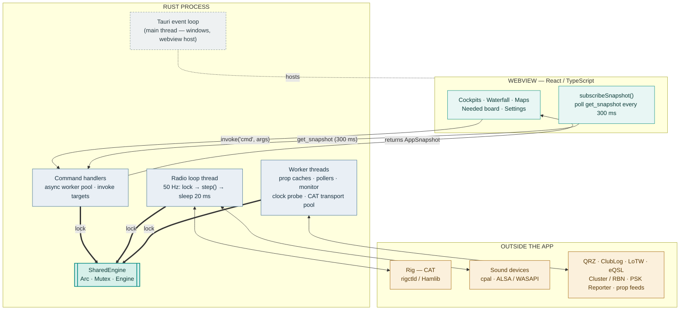
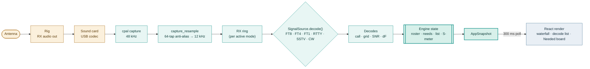
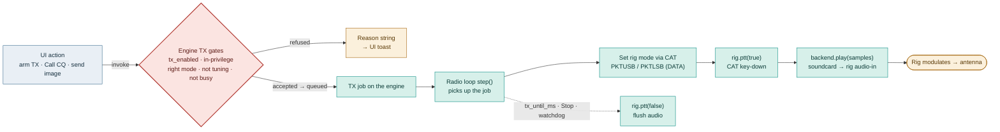

# Nexus — Architecture & Data Flow

How the app is wired: a Rust core that owns all state and every real-time deadline,
a web front-end that pulls a snapshot and paints it, and one lock where they meet.
This is the app-level / runtime view; for the FT1 chat layer and modem internals see
[`ARCHITECTURE.md`](ARCHITECTURE.md).

> **The one idea everything hangs on:** the UI is a pure function of a single
> `AppSnapshot`. Nothing in the browser is authoritative — it is a projection of the
> engine, sampled a few times a second. That keeps the transmit-safety logic in Rust,
> makes the UI reproducible from a fixture, and lets the real-time loop run at its own
> cadence without ever blocking on a repaint.

---

## 1. System architecture

Three zones run concurrently and meet at exactly one place: the engine mutex. The Tauri
main thread only hosts the window and webview — it runs neither the commands nor the loop.

| Piece | What it is |
|---|---|
| **SharedEngine** | `Arc<Mutex<Engine>>` — the single source of truth. Registered once with Tauri's `.manage()`, handed to every command via `State<'_, SharedEngine>`. The command workers *and* the radio loop lock this same mutex. |
| **Command workers** | Each `invoke('cmd')` runs on Tauri's async pool (not the main thread). It locks the engine, reads/mutates, returns a fresh `AppSnapshot`. Blocking I/O (HTTP, rotor CAT) goes to `spawn_blocking`. |
| **Radio loop** | A `std::thread` (behind the `radio` feature) running `tempo_audio::service::run_radio`. Each tick: **lock → `state.step()` → sleep 20 ms** — ~50 Hz, driving CAT, PTT, audio capture/playback, and the decoders. |
| **Worker threads** | ~15 background workers behind the same mutex: propagation caches, spot/RBN/cluster pollers, the headphone-monitor tee, a CAT clock probe, a persistent CAT transport pool. |
| **Main thread** | Runs only `tauri::Builder…run()` — the OS event loop owning the windows/webview. Hosts the UI; runs no app logic. |

---

## 2. Receive path — RF to screen

Audio arrives from the rig's codec, is anti-alias decimated to the modem rate, and fed to
a pluggable decoder. Decodes fold into engine state, which the UI samples on its next poll.
A pipeline with one pull at the very end.

**The decoder is an interface, not a hard-coded path.** Every mode implements one trait,
`SignalSource`, with `decode(&DecodeRequest) → Vec<Decode>`. The request carries the audio,
the search band, the a-priori context (your call, the worked call), and a **decode-depth
knob** (`ndepth`: 1 Fast … 3 Deep) that gates the expensive multi-pass subtraction and
deep-recovery passes. A native FT8/FT4 source runs the Rust modem kernel; a "companion"
source drains decodes from an upstream WSJT-X UDP stream. The loop doesn't care which.

> That same `ndepth` knob is the Raspberry Pi lever: a slow Pi 3 can't finish a deep decode
> inside the slot, so `Settings ▸ Decode depth ▸ Fast` drops the heavy passes and keeps it
> real-time. No new code path, just a lower setting.

A decode isn't only text. The engine cross-references each against the log and the
operator's needs (new DXCC, band-slot, mode, zone), tags it, and folds it into the roster,
the Needed board, the map's `needByCall`, and the mode-labelled spot feed. All of that is
resolved before the UI polls; the front-end renders the verdict.

---

## 3. Transmit path — click to carrier

Transmit is the opposite direction and the higher-stakes one, because it keys a real radio.
Every send runs a gauntlet of gates before anything is queued, and the radio loop is the
only code allowed to key.

> **The DATA-mode subtlety (why "keyed but no RF" happens):** on the common Icom /
> default-Yaesu setup, plain USB/LSB takes TX audio from the **mic**, not the USB codec, so
> keying with soundcard audio radiates nothing. The fix is to command a **DATA submode**
> (PKTUSB/PKTLSB) before PTT, which routes the codec to the modulator. FT8 always did this;
> the mode step above is where RTTY-AFSK and SSTV now do too.

**Gates before anything keys:**

- **Armed** — `tx_enabled` is off by default (WSJT-X "Enable Tx"); nothing transmits until armed.
- **In privilege** — the frequency must sit inside the licensed segment, or TX locks out.
- **Right segment** — SSTV rides Phone, RTTY its own mode; a send is refused if the app isn't there.
- **Exclusive** — one transmission at a time; mic PTT, voice keyer, RTTY and SSTV can't overlap.
- **Bounded** — a TX-watchdog and a per-over `tx_until_ms` deadline drop PTT unconditionally.

Only the radio loop calls `rig.ptt()`. Commands never key directly — they queue intent
behind the gates, and the 50 Hz loop acts on it a tick later. Keying stays on one thread
with one fail-safe instead of scattered across UI handlers.

---

## 4. Why it's shaped this way

| Choice | Rationale |
|---|---|
| **Pull, not push** | The UI polls `get_snapshot` every 300 ms rather than subscribing to events. Every render is a whole, self-consistent snapshot, never a stream of partial deltas. Command responses *also* return a snapshot, so an action updates instantly. |
| **One mutex** | A single engine lock is easy to reason about and keeps the real-time loop and the UI consistent. The cost: `get_snapshot` does an `O(roster×log)` worked-before scan under the lock, which is why the poll sits at 300 ms and not faster. |
| **Thin webview** | A stateless UI keeps transmit-safety logic in Rust, makes the front-end reproducible from a snapshot fixture (how its automated GUI QA works), and makes a torn-off multi-monitor window just the same app rendering one panel. |
| **Trait-per-mode** | The `SignalSource` abstraction lets FT8, FT4, FT1, and a WSJT-X-companion feed share one loop, one snapshot, and one TX gauntlet — new modes plug in without touching the plumbing. |

---

*Three zones — UI commands · the 50 Hz radio loop · worker threads — one `Arc<Mutex<Engine>>`.*
