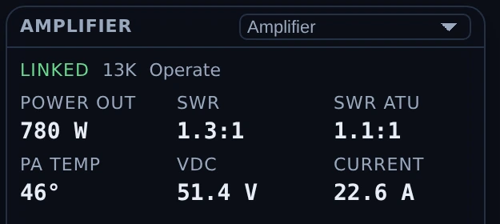
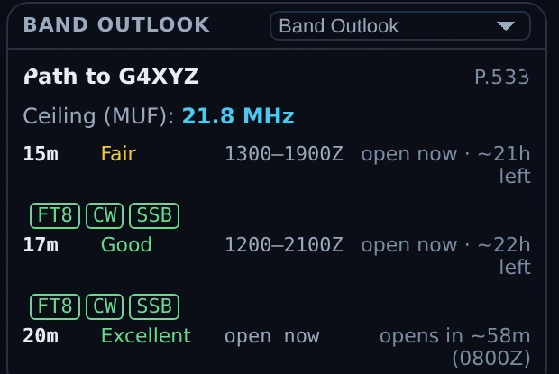

# Conditions — map + propagation

Conditions is Nexus's situational-awareness surface: one screen that fuses live
spots (PSK Reporter and RBN/DX-cluster) with NOAA space weather, draws them on a
map, and reasons about them with an honest opening detector and a native ITU-R
P.533 propagation engine. It answers three questions all the time — *is the band
open, am I getting out, what do I need* — and lets you double-click anything on
the map to work it.

A design rule runs through the whole section: **evidence or it didn't happen.** A
band is "open" when stations near *you* are demonstrably heard both ways, not
when one big station far away has a good morning. Modelled data is always
labelled "modelled"; the UI never dresses an estimate as a measurement.

Conditions has no radio controls. The bar across the top of the other screens (the
frequency, the band list, TX Off, Tune and Stop TX) is not shown here, so the map
and its panes get the whole height. To stop a transmission while Conditions is on
screen, press **Esc**, or go to any other screen and press **Stop TX** there.
The bar's UTC clock stays: it sits at the end of Conditions' own header in every
layout, with your local time beside it if you turned that on in **Settings ▸
Workspace**. In the dashboard window and on the TV page the bar across the top
carries the big clock instead.

<!-- TODO: capture screenshot — Conditions — the shaded 3-D globe with panes wrapped around it -->

## The tour

### The map

One **map picker** at the top of the map chooses the view:

- **Globe** — a 2-D globe you can spin and zoom (where a new view starts),
- **3D** — the shaded WebGL globe (greyed out on a PC whose graphics can't run
  it),
- **Flat** — the world map with shaded relief,
- **Beam** — an azimuthal-equidistant beam map with true great-circle headings
  from your QTH.

Each intent preset remembers its own pick. **Layers** sits in the top-left
corner of every view and folds away to a pill, the same way the Propagation card does.

The **Layers** menu toggles what's drawn on top:

- **Greyline** with graded civil / nautical / astronomical twilight,
- **Sun and moon** — the sun where it is overhead, at the centre of the day side, and the moon
  where it is overhead, lit as much as the real one and on the side you see lit from your
  hemisphere (on by default; during an M-class flare the flare layer's animated sun takes the
  sun's place),
- **shaded relief** (bundled offline),
- **band-heat auras**,
- **live spot dots** — grid-placed, age-faded, and colored by what they're worth
  to your log,
- **DXpedition markers** and **range rings**,
- **modelled MUF** and the **NOAA aurora oval**,
- **Satellites (amateur)** — mini icons that *move* in real time (interpolated
  every second), each with a fading trail behind and a dashed projected path
  ahead (~25 min); a chased bird renders larger with its footprint ring,
- **Proton polar cap (PCA)** — violet polar shading that appears **only during a
  real S1+ proton event** (on a quiet sun it honestly draws nothing),
- **CQ zones** — boundary lines and zone numbers (off by default),
- **Grid labels** — field letters that densify to 4-character squares as you zoom
  (off by default).

Everything is interactive: hover for a call / entity / band / age / bearing
tooltip (bearings read like `312°T (316°M)`, magnetic from WMM2025), click for a
detail rail, and **double-click to work** — the same atomic QSY path as the rest
of the app.

Four **intent presets** — Chase DX, POTA/SOTA, Ragchew, 6m/VHF — configure the
whole surface in one tap.

*The Layers menu in Nexus 1.10.3. Which boxes are ticked is one operator's
preference, not a recommendation.*

### The street map (not yet available)

> **Not yet available.** The Street choice is built but hidden: it appears once Nexus's street maps
> are hosted.

**Street** is an optional fifth choice in the map picker: a street-level map of your area,
downloaded once and kept on your computer, with your Conditions layers drawn on it. Until you
download an area it carries a download badge, and pressing it opens the download sheet:

- **Where** — around your station (from your grid square) or around the map's centre,
- **How big** — a square 50, 100, **200** or 400 km across,
- **Detail** — **All streets** or Main roads.

The sheet shows the exact size before anything downloads, your free disk space (a download needs
twice its size free) and the map data's licence. A download carries on while you use Nexus, shows
its percent on the Street choice, and resumes after a restart or a dropped connection.

On the street map, drag and the mouse wheel move the map, a double-click on a spot or park works
it as anywhere else, and a double-click elsewhere zooms in. From about city zoom, a station or spot
known only by its grid square is drawn as that square's outline, not a pin (parks and APRS stations
with their own coordinates stay pins), and grid labels run down to 6- and 8-character squares. The
world-scale layers (MUF, aurora, flare, PCA, band heat) are greyed in **Layers** there: they show no
street-level detail. Street needs WebGL2; where a Street pick cannot draw (no area downloaded, or
graphics without WebGL2) the map shows Flat and says why.

**Settings ▸ Appearance ▸ Map & globe ▸ Street maps** lists each area you have (size, detail and the
date of its map data), checks for newer map data only when you press **Check for updates**, and
removes an area, saying how much space that frees.

Street maps live outside your data folder, and uninstalling Nexus leaves them. To remove them by
hand, close Nexus and delete:

- Windows: `%LOCALAPPDATA%\Nexus\maps`
- macOS: `~/Library/Application Support/Nexus/maps`. Nexus's other local files on a Mac (its
  diagnostics log, `ALL.TXT` and the SSTV gallery) are in a second folder, `~/.local/share/Nexus`;
  delete that too to remove everything Nexus keeps on the computer.
- Linux: `~/.local/share/Nexus/maps`

Map data © OpenStreetMap contributors, under the Open Database Licence (ODbL).

### The pane grid

Around the globe is an **assignable pane grid** — seven slots
(left ×2, right ×2, bottom ×3). Each pane frame has a picker in its corner: click
it and choose what that slot shows. Every pane renders in full; the one-line
plain-language version of a pane is what you see while it is waiting on data,
offline, or has nothing to report, not a density setting. (There was a
**Basic / Expert** switch that chose between the two by hand; it was removed on
2026-07-26 and there is no such control now.)

You don't have to keep all seven. Each pane has a **✕** on its header to close it,
and the **Panels** menu in the Conditions header lists what's closed so you can bring
it back, with **Undo** and **Reset layout**. When a pane closes, its neighbour
takes the space; close both panes on a side and the map takes the width. Drag the
edge of a side column to make it wider or narrower (200–720 px; the map never goes
below 280 px), or drag between its two panes. Both handles also work from the
keyboard, and a double-click puts the default back. What you close and how wide
you make things is remembered per window, and a saved width is trimmed to fit a
smaller screen. **Reset layout** puts every pane back open at the usual widths, the
**Standard** layout, including which pane sits in each slot.

**A pane's own menu.** Each pane's header has a **⋯** button beside the ✕ (the
picker next to it is a little narrower to make room, and in the narrowest columns a
long pane title can end in "…"). Its
**A+ Larger text** and **A− Smaller text** make that pane's words bigger or smaller,
from 80% to 160% of your Text size (Settings ▸ Appearance ▸ Workspace), 10% a
press; the menu stays open and shows the size, so you can press again. Only the
words change: the pane keeps its place and size, its header stays as it was, and a
pane whose text no longer fits scrolls. Each pane keeps its own size in each
window. A layout from the Panels menu keeps the sizes; **Reset layout** puts every
pane back at 100%. The same menu has **? … in the manual**, which opens this
manual in your browser at the part about that pane; a pane this manual does not
describe yet has no link.

**Tabs.** A slot can hold more than one pane. **⋯ ▸ Add a tab** lists the panes it
can take; pick one and it joins the slot, shown, and the slot's title becomes a row
of tabs (in a narrow column, a row of its own under the picker, ⋯ and ✕). Click a
tab to switch, or use ← →, Home and End on it. The picker changes
the pane on the tab that is showing, and **⋯ ▸ Remove … from this slot** takes it
out. A pane is only ever in one slot: adding one from another slot moves it, and a
slot's only pane is not offered, since that slot would be empty. Each slot reopens
on the tab it was showing. A layout from the Panels menu, or **Reset layout**, puts
one pane back in each slot; **Undo** brings the tabs back.

In the dashboard window and on the TV page, a slot with tabs can also show them in
turn: **⋯ ▸ Rotate the tabs** and pick 10 s, 15 s, 30 s, 1 min or 2 min. It is off
until you pick one. It waits while the mouse is over the slot, while you are in it
with the keyboard and while its menu is open, and starts the interval again after.
The main window's Conditions never rotates, so what you are looking at while you
operate never changes by itself.

**Layouts.** The **Layout** button in the Conditions header, beside **⊞ Panels**, opens
five ready-made arrangements of the same panes (the Panels menu shows the same
choices at its top), and names the layout on screen: **Standard** (every pane open, as
Conditions opened before Frame + bar became the default), one of the five, **Your earlier
layout** (below), or **Custom** once you have moved or resized anything yourself.
**Standard** is the first choice in the list, so going back to it is one tap, and **Undo**
takes that tap back like any other. Unlike **Reset layout**, it keeps your panes' text sizes.

| Layout | Left column | Right column | Bottom row | Column width |
|---|---|---|---|---|
| Map first | Best band, Band Advisor | Chase, Space Wx | closed | the narrowest, 200 px |
| List first | Chase, Chase Feed | Getting Out, Openings | closed | wide, 560 px |
| Dashboard | Space Wx, Band Advisor | Chase, Getting Out | Openings, Band Outlook, Greyline | 400 px |
| Frame | Band Advisor, Space Wx | Getting Out, Chase | closed, so the map runs the full height (and Satellites turns on) | 400 px |
| Frame + bar (default) | Bands for you, Openings | Chase, Getting Out | closed, so the map runs the full height | 400 px |

A layout applies only when you pick it, and nothing snaps back afterwards: change a
pane or a width and the menu reads Custom. Over an arrangement of your own the menu
says that a pick replaces it, and **Undo** puts it back, widths included. The panes a
layout closes stay in their slots, so ticking one in the menu brings back what the
layout parked there. On a smaller window the columns narrow to fit (the map keeps
its 280 px minimum). With a large zoom on a smaller screen every pane keeps its title
bar, with its picker and ✕, in view, and when even that does not fit, Conditions scrolls.
A layout never changes the map's own settings: the Globe, 3D,
Flat or Beam pick, the layers and the colouring stay as you left them for each intent.
The one exception is **Frame**, which also turns on **Satellites** on the map and the 3-D
globe. It never turns a layer off, if you untick Satellites afterwards it stays off, and
**Undo** turns it back off with the rest of the layout.

**Frame + bar (default)** is how Conditions opens. It puts the dashboard window's bar
across the top of Conditions: your
callsign and grid, a big UTC clock beside your local time, and the day's SFI, Kp,
sunspot number, A, X-ray and solar-wind speed. Its four boxes keep the others one
click away as tabs: Band Advisor, Bands by region, Activity Matrix and Best band
behind Bands for you; Sporadic-E, Openings Log, Insights and 24h Band×Hour behind
Openings; Chase Feed, Selection, Contests and Satellite Passes behind Chase; Space Wx,
Kp outlook, Measured MUF, NCDXF Beacons and Greyline behind Getting Out. The closed
bottom row keeps Band Outlook and the Clock, Rotor and Amplifier, and Band Scope.
Clicking a tab is not a change of layout. The bar stays while you change things
yourself; another layout, **Undo** or **Reset layout** takes it away. The map is left
as you had it, its Propagation card included.

**The switch to Frame + bar, once.** After the update Conditions opens in Frame + bar
once, in the main window, the dashboard window and on the TV page, whatever layout it
had. If you had arranged it yourself, your arrangement is kept: **Layout ▸ Your earlier
layout** brings it back exactly, with its boxes, tabs, widths and splits, in one tap, and
it stays in the list. If you were on Standard or one of the five layouts, pick it again.
The switch happens once and never again, even after a reinstall or a restore from a
backup. A dashboard window you never arranged follows the main window, as it always
has. The TV page opens in its own Frame + bar, without the boxes it can never fill
there: Space Wx and the Kp outlook take Chase's place, and the closed row keeps Band
Outlook, Satellite Passes and the Clock.

**Conditions in its own window.** **⧉ Pop out** in the Conditions header opens Conditions as a
dashboard window for a second monitor or a screen of its own. It opens at 1600 × 1000,
or your whole screen if that is smaller, with the full layout, and a bar across the top
shows your callsign and grid, a big UTC clock beside your local time, and the day's SFI,
Kp, sunspot number, A, X-ray and solar-wind speed (a dash for each when there is no live
data, and a note when the numbers are old). In a storm Kp, X-ray and the solar wind turn
amber when the Space Wx box's gauges reach their warning level (in the light theme the
number stays dark, underlined in amber). The sunspot number is NOAA's daily count,
shown with the day it is from, as in the Space Wx box. Close it and it comes back on the
same monitor, in the same place and at the same size; if that monitor is gone it opens
in the middle of your main screen, sized to fit. The window keeps its own layout, so a
layout picked there leaves the main window's Conditions as it was. On Windows the bar also
has a **Stay behind** button: pressed, the window stays behind your other windows even
when you click on it, so it can fill a screen behind Nexus without covering the cockpit.
A click on it still moves the keyboard to it: until you click back into Nexus the keyboard
is the dashboard's, so Esc stops nothing then. The Stop TX button always works (with
Conditions in the main window there is none: click back into Nexus and press Esc).

**Beside a cockpit: the dashboard rail.** The same boxes can stand in a column at the right of
an operating cockpit (Operate, Phone, CW, RTTY, PSK, SSTV, APRS and JS8), so the time, the bands
and who hears you stay in view while you operate. It is off until you turn it on: tick
**Dashboard rail** in the cockpit's **⊞ Panels** menu, or press **Dashboard** at the right end
of the Now-Bar. Each cockpit remembers its own choice. The rail opens with the **Clock**,
**Bands for you**, **Space Wx** and **Getting Out**; each box has the same picker as a Conditions
slot, so any pane can take its place, its **✕** closes it, and the **⊞ Panels** menu in the
rail's head brings a closed box back or resets the rail. A box's **⋯** sets its own text size
there as on Conditions (tabs stay Conditions'), and the rail's Reset puts every box back at 100%.
Drag the rail's left edge to make it wider or narrower (200–720 px), or the line between two
boxes to share the height between them; both also work from the keyboard, and a double-click
puts the default back. The rail shows only
on a large window, about 1600 px wide at your zoom (a 1366×768 laptop at its usual 85 %
qualifies), and the cockpit beside it is never narrower than it is on a 1024×768 screen, so a
saved width is trimmed to fit. On a smaller window the rail stays hidden, and the ⊞ Panels entry
keeps your choice and says why. The rail has no transmit control, and clicking a station in it
selects that station in the rail only, never the station your cockpit is working. A **Spots** or
**POTA / SOTA** box works a spot there as it does on Conditions: a click on a spot, or on **HUNT**,
moves the radio to the station and opens its screen. Nothing transmits. The rail reads the
same live data Conditions does, and within a window the two share each request, so nothing is
fetched twice.

The panes you can assign:

| Pane | Shows |
|---|---|
| Best band | the propagation headline (which band is best now) + any warning banners |
| Band Advisor | every HF band ranked best-first, with plain reasoning |
| Bands for you | each band as a tile saying Open, Marginal or Closed for you now, with a dot when the band is being heard, ★ on the best band and a ring on your radio's band; click a tile to show that band on the map |
| Selection | detail on the station/spot you clicked, with a ▶ Work button |
| Band Outlook | modelled workable bands to DX (or the path to a selected call) |
| Openings | detected band openings around you |
| Openings Log | every band opening Nexus has detected (6 m and 2 m tropo, sporadic-E, aurora), with its band, kind, start, length, longest path and the most stations heard, kept from one session to the next |
| Space Wx | solar/geomagnetic gauges (the solar-wind speed among them), 30-day solar flux and sunspot-number lines from NOAA's daily indices, and the NOAA scales annunciator |
| Kp outlook | NOAA's three-day planetary-K forecast as bars, the measured hours solid and the forecast hollow, with when a storm is expected to start or settle |
| Getting Out | who is hearing you right now: a compass, and every station that heard you in the last half hour, with its direction and distance, band, SNR and how long ago |
| Bands by region | the best band to reach each region |
| Activity Matrix | a region × band grid of live activity |
| NCDXF Beacons | the NCDXF beacon schedule, with heard badges |
| Insights | notable propagation events, narrated |
| Chase | the "work THIS now" pane — needs fused with band openness |
| Chase Feed | the ranked chase board (need × openness × rarity × ends-soon) |
| Greyline | your next greyline window |
| 24h Band×Hour | a band × hour likelihood heatmap |
| Sporadic-E | live VHF Es openings when present |
| Measured MUF | real ionosonde MUF measurements |
| Satellite Passes | next amateur-satellite passes over your grid |
| Rotor | rotator control + compass, and the elevation on an az/el rotator (appears once a rotctld is configured) |
| Contests | upcoming HF and VHF contests from the WA7BNM calendar, grouped as on now, soon, this week and later |
| Band Scope | a live spectrum of your radio's passband, band noise and signals at a glance; flat while the radio's audio is not reaching Nexus |
| Amplifier | your linear's own readings (appears once an amplifier is configured) |
| Clock | UTC and local time in large digits, the date, and today's sunrise and sunset at your grid |
| Spots | the [Spots](spots.md) screen's list of every spot on the air, with its search and filters; a click works the station exactly as it does there |
| POTA / SOTA | the [POTA/SOTA](contesting-pota.md) hunter's list, with its tabs, Hide worked today, Refresh and **HUNT**; its band, mode and sort choices open on its Filter button |

The **Spots** and **POTA / SOTA** boxes are those screens' own lists, so a click on a spot or on
**HUNT** does what it does there, and nothing transmits. In Conditions' own window (**⧉ Pop out**)
they work the same way, through that window's own Needed and POTA/SOTA boards, and the main
window follows to the screen the station needs. Each box keeps its own filters, apart from
the screen's. In a narrow box the Spots list shows the call, the frequency and the mode, adds the
age, the country and the comment as the box widens, and shows every column from about 640 px;
the list scrolls inside the box. The wall display (the TV page) shows no spot list, and each box says so there.

The default layout puts the conditions reference on the left, the flagship
**Chase** pane and Band Outlook on the right, and a live "now" ticker (Openings,
Space Wx, Getting Out) across the bottom.

### The Amplifier pane

If you run a linear — an **SPE Expert** (1.3K-FA / 1.5K-FA / 2K-FA) or an **Elecraft
KPA500/KPA1500** — put it on its own serial port, set it under
[Settings ▸ Radio ▸ Amplifier](settings-reference.md#radio), and assign this pane to a
slot. It shows power out, SWR at the antenna and before the tuner, supply volts and
current, PA temperature, and the amplifier's own alarms and warnings.

*The Amplifier pane in Nexus 1.10.3. Everything in it is **telemetry the amplifier reported** —
there is no control here. Operate/Standby and the band ladder ride in the cockpit's own
amplifier strip, where you are transmitting. The temperature prints with a degree sign and no
scale letter because the SPE protocol does not state the unit. No amplifier was connected for
this capture; the readings are a documentation fixture.*

It has to be **its own port**. A serial port can only be opened once, so an amplifier
typed onto the CAT port does not give you a silent amplifier — it gives you a radio
that will not connect. Nexus checks for that and warns, naming the radio and the port.

Two things it deliberately does not do. **Readings clear the moment a poll goes
unanswered**, rather than holding the last value: a stale wattage beside a dead link is
a fabricated number, and an em dash is not. And an **alarm code this build has never
seen still shows as a fault** rather than going quiet — the failure direction in front
of a kilowatt has to be toward telling you.

The SPE temperature carries no °C or °F letter, because the protocol does not say which
it is; the amplifier reports whatever its own front panel is set to. The Elecraft does
carry one, because Elecraft documents it.

**And you can drive it from wherever you are operating.** With an amplifier configured,
every cockpit header — Phone, CW, Operate, RTTY, PSK and SSTV — carries a compact strip:
**Standby/Operate**, band **◀ ▶**, and power out. Nothing is added for the stations that
have no amplifier; the strip simply is not there.

Operate reads from the amplifier itself rather than from your click, so the button shows
where the amplifier actually is even when you press its front-panel key instead. Both
controls are **refused while you are transmitting**: changing band on a keyed amplifier
can damage it, and dropping to standby mid-over does not stop anything — the exciter
keeps keying and the drive passes straight through. For the same reason, standby is not
a way to stop a transmission and the strip is not a stop control.

**Nexus will never switch your amplifier off.** That command is not merely unused; it
does not exist in the code, so no future change can reach it by accident.

**Following the radio's band is optional and off by default.** Turn it on under
[Settings ▸ Radio ▸ Amplifier](settings-reference.md#radio) and the amplifier steps to
whatever band you tune to. It steps one band at a time and reads where the amplifier
actually is after each step, so a step it ignored — or one you undid at the front panel
— is seen and re-issued rather than assumed. On a band your amplifier does not have it
does nothing rather than picking the nearest, and it never moves anything while you are
transmitting.

⚠️ **Most SPE stations should leave it off.** An SPE is normally wired to follow the
radio through its own band-data cable, in hardware. Where that cable is fitted this
setting is a second thing steering one band — redundant at best, and at worst two
controllers disagreeing about where the amplifier should be.

## Core workflows

### Assign a pane to a slot

*A pane picker open in Nexus 1.10.3, when its headings were Panels, B2 and B3.
They now say what the boxes under them are for: **Bands**, **Space weather**,
**Activity** and **Station**, in the picker and in **⋯ ▸ Add a tab** alike. Any
pane in any group can go in any slot.*

1. Click the picker in any pane frame's corner.
2. Choose a pane from the list. If that pane already lives in another slot, the
   two **swap** — nothing ever vanishes from the grid.
3. Your layout persists across sessions — the grid comes back as you left it.

### Read an opening

The **opening detector** compares a 10-minute window against a 2-hour robust
baseline (median + MAD z-scores), anchored to your station, and requires
**reciprocal paths (heard both ways)** before it declares — with anti-flap
hysteresis and mode-specific dwell times. When it fires, a rule-ordered
classifier labels the mechanism — **sporadic-E, F2/TEP, aurora** (with skip-hole
disambiguation), or **tropo** — and the right rail shows the band, direction
octant, distance, and the participating stations.

### Chase what's workable now

The **Chase** and **Chase Feed** panes fuse the [Needed board](needed-dx.md) with
band openness and timing: they surface the stations that are both *needed* and
*heard*, scored by need × openness × rarity × time-remaining. Each row has a
why-line and a ▶ **Work** button that QSYs and opens the right cockpit. Chase
leads with the top few; Chase Feed is the full ranked table.

### Track propagation to a specific call

Click a station on the map (or in a pane) and the **Selection** and **Band
Outlook** panes switch to *that call*: the modelled path, its MUF ceiling, and
per-band workability. With the P.533 engine selected you also get per-mode
FT8/FT4/CW/SSB "workable now" chips.

*Band Outlook in Nexus 1.10.3 with a call selected. The heading becomes **Path to G4XYZ** and
the engine names itself on the right (**P.533**) — everything in this pane is *modelled*,
including the FT8/CW/SSB chips. The *observed* half is a different pane: **Getting Out** lists
the stations that actually reported hearing you. Both are documentation fixtures here — no path
was solved for a real contact, and nobody reported this station.*

### Choose the prediction engine

In [Settings ▸ Logging & Connectors](settings-reference.md#integrations--feeds),
**Prediction engine** selects **Modelled (fast heuristic)** or **ITU-R P.533
(full physics)**. P.533 is the real circuit-reliability method (validated
against the ITU reference, ~0.1 s per prediction, and it uses your station power
and antenna gain). **Live spots always win over any model.**

## The Now-Bar

The persistent **Now-Bar** carries the Conditions intelligence into every section of
the app: is the band open, am I getting out, what do I need — with feed-health
pills that distinguish "connected but quiet" from "down," so a silent band never
looks like a dead feed.
Beside an operating cockpit on a large window, its last button, **Dashboard**, shows or
hides the dashboard rail (above).

## Honest limits

- **The per-path 24-hour outlook is a physics-lite in-house heuristic** (MUF +
  D-layer) and is labelled "modelled." The P.533 engine is a fuller model but is
  still a *model*; live spots override both.
- **VOACAP is not integrated.**
- **PSK Reporter's MQTT band topics carry no SNR**, so SNR-derived features
  degrade gracefully where the data isn't present.
- **The "getting out" inference is disabled on VHF**, where sporadic-E patch
  disjointness makes a region-reach claim invalid.

## Related guides

- [Needed — DX that's on the air now](needed-dx.md)
- [Spots](spots.md) — the same cluster/RBN traffic as a table, unranked
- [APRS](aprs.md) — the other map in the app, plotting the packet stations your
  own receiver decodes
- [Satellites](satellites.md)
- [DXpeditions](dxpeditions.md)
- [Settings reference](settings-reference.md)
