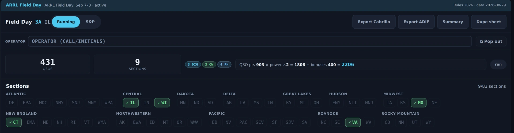
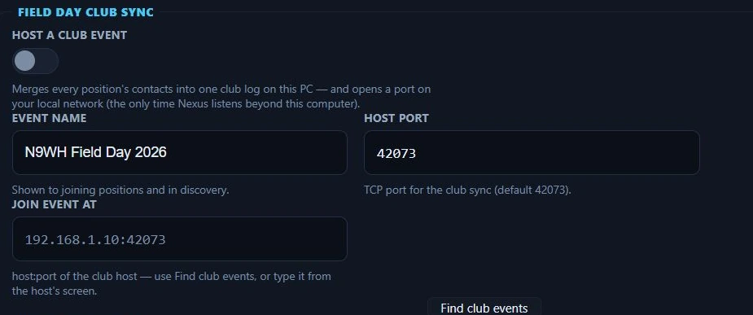
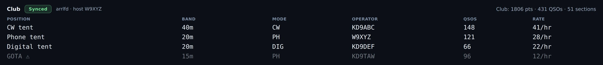
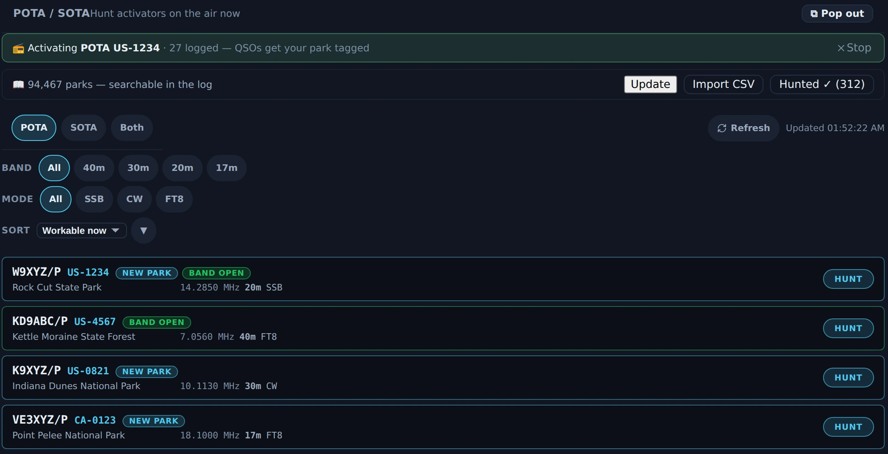

# Contesting & POTA/SOTA

Two portable/event workflows live here: **Field Day** (ARRL or Winter Field Day),
which reshapes the app for the weekend and pushes to the club's master log in
real time, and the **POTA/SOTA hunter**, which finds activators and tags your
contact for upload. The hunter ships enabled — the wizard turns everything on.
**Field Day mode is the exception**: it stays off until you switch it on at the
top of the **Contest** screen (the tent in the left bar), in
[Settings ▸ Appearance ▸ Features](settings-reference.md#features) or in
[Contesting ▸ Field Day Setup](settings-reference.md#field-day-setup), because it
reshapes the app for a weekend most operators are not having.

---

## Field Day

A settings switch turns the event on and the app reshapes for it: the exchange
grammar, a live countdown that knows the real date rules, per-(call, band,
mode-class) dupe checking, and a scoreboard.

<!-- TODO: capture screenshot — Field Day mode — exchange entry, countdown, live scoreboard -->

### Set it up first

*Field Day Setup in Settings ▸ Contesting, Nexus 1.10.3, with Field Day mode
off. The class, section and multiplier shown are one station's own entries —
set yours from the rules for the event you are in.*

In [Settings ▸ Contesting ▸ Field Day Setup](settings-reference.md#field-day-setup):

1. **Event** — ARRL Field Day or Winter Field Day. This changes scoring labels
   and export headers.
2. **Class / Category** and **ARRL Section** — these start **empty on purpose**,
   and Field Day refuses to start until you set yours. (An old default of "WI"
   sent the wrong exchange for everyone outside Wisconsin — now it's a one-time
   deliberate step.) ARRL FD wants a class like `1D`; WFD wants its class number
   and category letter, like `2O` (two transmitters, outdoor).
3. **Power multiplier** — ×5 (QRP/battery ≤ 5 W), ×2 (≤ 100 W), or ×1 (> 100 W).
   It multiplies your QSO points; the engine clamps it to the legal values.

### Operate the event

Field Day is **all-mode**: once you initiate a contact, the digital sequencer
runs the FD exchange autonomously, and the [CW](cw.md) and [Phone](phone.md)
cockpits' log strips become FD entries with class/section and **shared dupe
checking** — one laptop covers the whole operation.

*A Field Day **test event** in Nexus 1.10.3 — a fixture, not a submitted entry. The banner
names the event and the rules year it is scoring against; the counters and the arithmetic line
show the whole sum (**QSO pts 903 × power ×2 = 1806 + bonuses 400 = 2206**), and the sections
board marks what has been worked out of 83. The per-contact exchange — class and section — is
typed in the cockpit log strips and lists under this panel.*

**Super Check Partial and call history**, in every contest. As you type a call in a log
strip, a line under the boxes lists the calls active in recent contests that contain what
you have typed; click one to use it. The list is `MASTER.SCP` from supercheckpartial.com
(maintained by W9KKN): Nexus downloads it the first time a contest starts and checks for a
newer one at most once a day, and it is never shipped with Nexus. If you imported a
call-history file for this contest, the boxes it can check (a county, state, section or zone
the contest accepts) fill from it as you type, marked **history**, and whatever you type
wins. Unassisted mode turns both off. Both are set up in
[Settings › Contesting](settings-reference.md#super-check-partial-and-call-history).

The log strip in the [Satellites](satellites.md) section switches too, and it is
the one strip that does **not** take the band off your dial. It files each
contact on the band of the transponder you were holding, so you can work the
pass, turn the rotator by hand, and write the contact up once your hands are
free — the band, the frequency and the satellite tag all come from the bird, not
from whatever the radio moved to afterwards.

Everywhere else, **log as you work**: the FD log stamps each contact with the
band the radio is on at the moment you type it, so a contact entered after you
have QSY'd away files on the wrong band, both in the Cabrillo and on the
N1MM / N3FJP wire.

Logged the wrong contact? **Press Ctrl+D twice**, or click **Remove last** beside Clear
twice: the first press names your newest contest contact on the strip, the second removes
it. It is kept under **Removed** on the contest screen, out of the score and every export,
and **Restore** puts it back exactly. The [Field Day manual](../manual/Field-Day.md#take-back-the-last-contact)
has the details, including where a contact may already have gone.

The scoreboard shows its work: QSO points (phone 1, CW/digital 2) × the legal
power multiplier + a 16-item ARRL bonus checklist = total. **Winter Field Day
scores by its objectives instead**: QSO points × (the objective multipliers + 1),
from the sponsor's thirteen 2027 objectives, which you tick on the contest screen
in place of the bonuses (the [Field Day manual](../manual/Field-Day.md#winter-field-day-scoring)
lists them). While Winter Field Day runs, Nexus posts no spot over the internet,
as its rules ask.

Opening **Bonuses** does not cost you the sections board. The board is the only
part of the Field Day column that can give height, so it used to give it for
everything else and collapse to a blank strip when the fifteen-row checklist
opened. It carries a floor now and the column scrolls past that floor, so the
board a club watches all weekend stays a board. The checklist keeps its own cap
and scrolls inside itself: all fifteen rows are there, in a list of their own,
rather than 290 px of checkboxes between you and the log.

### An operator and a logger on one radio

Many clubs put two people on one station: the operator on the radio, and a logger on a second
keyboard and mouse at a second monitor (MouseMux gives each of them their own). Click
**⧉ Logger window** on the Contest screen, or in the torn-off scoreboard beside the operator box,
and drag the window to the logger's monitor. It holds the whole Contest screen with a log line
under it, and it opens on that monitor again next time.

- **One contact, two windows.** The logger's line and your own contest log strip are the same
  contact: whatever either of you types shows in both as it is typed, with the same dupe warning,
  Super Check Partial line, call-history fill and Ctrl+D take-back line. Enter in either window
  logs it, once: if you both press it at the same moment, the second window is told it was
  already logged.
- **Nothing in the logger window transmits.** It has no PTT, no F-key messages and no Tune, and
  the F-keys and Space do nothing there but type. Its Esc clears the log line and never touches
  your over. Stop TX and every transmit control stay on your screen; the contest switch,
  Running / S&P and scoring are read-only in the logger window.
- It logs as this computer's own position, under the mode you are operating (phone, CW, RTTY or
  digital), so club sync, N3FJP and your exports see one station. A Remote viewer sees only the
  main window.

### Export and club interop

Exports are submittable: **Cabrillo 3.0** with real per-QSO UTC timestamps and
per-row mode tokens, plus **ADIF** with `CONTEST_ID`.

The club story is native:

- Every FD contact pushes in real time to **N3FJP** over its official TCP API
  (default port 1100). Configure the master log's host/port and use the **Test
  N3FJP** button at the site before the event.
- Nexus also broadcasts the native **N1MM+** `<contactinfo>` UDP datagram for
  N1MM-networked dashboards.

Both are fire-and-forget on background threads, so a hung logging PC can never
stall your TX slot. The WSJT-X UDP Status message sets `special_op = Field Day`,
so JTAlert/GridTracker auto-activate their FD behavior too.

Configure [N3FJP](settings-reference.md#n3fjp-integration-club-master-log) and
[N1MM+](settings-reference.md#n1mm-integration) in Settings ▸ Logging & Connectors.

### Run the whole club on Nexus (club sync)

*Field Day Club Sync in Settings ▸ Contesting, Nexus 1.10.3. Hosting is off
here — nothing is listening on the network until you turn it on.*

If every position runs Nexus, you don't need a third-party master log at all.
One PC at the site turns on **Settings ▸ Contesting ▸ Field Day Club Sync ▸
Host a club event**; every other position presses **Find club events** (or
types the host's address) and joins. From then on:

*The club board in Nexus 1.10.3, torn off into its own window. The chip beside **Club** is the
sync state, the host is named next to it, and the club totals sit on the right; each row is one
operating position, and the greyed **GOTA** row carries a ⚠ because the host has not heard from
it inside the stale line. **This is fixture state, not two instances that actually synced** —
no second Nexus was running, so the picture shows what the board looks like, not evidence that
a club sync worked.*

- Each logged contact streams to the host the moment it lands; the host merges
  everything into one club log and pushes the club totals back.
- Every position gets a **club dupe warning while typing** — if another tent
  already worked that call on this band and mode (and, at a QSO party, from
  the county you have typed), you're told before you call. It's a warning, not
  a lock (N3FJP semantics); your own log's dupes still refuse.
- A live **band board** shows where every position is (band, mode, operator,
  rate), stale-marked the moment one goes quiet. It has its own **Club Board**
  button in the left rail under Contest, and its own window — one click, on a
  second monitor or a corner of the big one, in bigger type than the dashboard
  copy because it is watched from across the tent. **Pop out board** in the club
  header opens the same window. The rail button is there whenever Field Day is
  on, before you have switched sync on: with sync off the window names the route
  that starts it rather than showing an empty board. The web scoreboard below
  carries the same band and mode per position, so the screen facing the room
  answers "who's on 20?" too.
- The sync chip tells the truth: **Synced**, **Behind n**, or **Offline** —
  contacts logged offline are journaled and re-sent automatically on
  reconnect. If the host PC dies, enable hosting on any other position;
  everyone re-joins and nothing is lost.
- The host exports the merged **club Cabrillo / ADIF**, deduplicated the way
  the rules score it (earliest contact wins). A contest that wants repeats
  reported, such as the New York QSO Party, keeps them in the file, scoring
  zero.

Hosting is the one time Nexus listens beyond the local computer, and only
while the toggle is on. There is no join password — a club site LAN is
trusted; the connection can only carry log rows, never key a transmitter or
change a setting. The N3FJP/N1MM pushes above keep working alongside if you
want both.

**Any contest on the picker, with two exceptions.** The club log runs the
contest the host has picked, under that contest's own rules: its exchange (a
QSO party keeps every county, and a mobile in a new county is a new contact),
what counts as a dupe (the Illinois QSO Party counts CW and digital as one
mode), its scoring and multipliers, and its own Cabrillo file and header lines.
The two exceptions are contests whose merged log would be wrong: one with a
serial number in the exchange (Sweepstakes, CQ WPX, the California QSO Party),
because the whole entry's numbers must run in one sequence and every position
gives out its own, and CQ World-Wide, whose log must say which transmitter
made each contact. For those a station neither hosts nor joins, and the contest
screen and the Club Sync settings say why. Every position must pick the
**same contest** as the host: a position logging another one is refused when it
joins, and the club chip names both contests. The [spectator
scoreboard](#the-spectator-scoreboard) shows the club's own contest too. The
manual's Field Day page has the steps for the Illinois QSO Party.

Before any club event:

- **Windows asks about the firewall** the first time a PC hosts, and the first
  time a position looks for club events. Allow Nexus on **Private** networks. If
  Windows calls the site network Public, change it to Private, because a Public
  network blocks all of it. The host listens on TCP port 42073 (the **Host
  port**) and announces itself on UDP port 42074, which **Find club events**
  listens for; the spectator scoreboard uses TCP port 7373. Nexus adds no
  firewall rule of its own.
- **Set every clock first.** Nexus never changes a PC's clock. Each position
  measures its clock against the host's every 5 seconds over the club link, and
  from 2 seconds off its club line says so ("This PC's clock is 3 s behind the
  host's"); past 30 seconds the line is a warning. The host's club board has a
  **Clock** column for every position, with a dash for one running an older
  Nexus. The contact times in the club log and in each Cabrillo file still come
  from each position's own clock, and when two positions log the same contact the
  club log keeps the earlier one, so put a wrong clock right in that PC's own
  date and time settings. Set every laptop from one source, a phone for example,
  before the event starts.

### The spectator scoreboard

Turn on **Spectator scoreboard** (Settings ▸ Contesting ▸ Field Day Club Sync)
and any browser on the site network can show the club's board: a TV or a
projector with nothing installed. The Settings row shows the address to open. The
board is made to be read from across a room, at 1080p and at 4K:

- the **claimed score**, made the contest's own way (QSO points times the power
  tier for ARRL Field Day, times the objectives for Winter Field Day, times the
  multipliers for a QSO party, plus the bonuses), and the **rate**: the last hour,
  the last ten minutes, and a bar for each hour;
- a **map of what the contest counts**: the sections globe for the two Field Days,
  and for the Illinois QSO Party the state's 102 counties, each lit when the club
  works it, with the host's own county outlined;
- each position's **band and mode right now**, the contacts by band and mode, the
  multipliers with their counts and caps, the bonus stations, the latest contact,
  the clock and the time left.

**Any station can show it.** The host shows its own club. A position shows the
host's board, fetched from the host it joined, so the TV can sit at any table with
a spare laptop; the host's Spectator scoreboard has to be on too, on the same port.
If the host can't be reached, the TV says so in plain words, keeps the last board
it had and comes back by itself. A station with no club says so, with what to do.
Add `?theme=light` to the address for the light board, or `?theme=auto` to follow
the TV's own setting.

---

## POTA / SOTA hunter

The hunter is for **finding activators, not running activations**. It polls the
official feeds (pota.app and SOTAwatch) every 60 s.

*The POTA / SOTA hunter in Nexus 1.10.3, showing live activators.*

### The tour

Live spots with program toggles (**POTA / SOTA / Both**), band and mode filter
chips, park names, and two ranking badges:

- **NEW PARK** — the reference has never appeared in your log (computed from your
  own ADIF, not an external tracker),
- **BAND OPEN** — PSK Reporter confirms your signal is reaching that band within
  the last 15 minutes.

### Hunt an activator

*POTA / SOTA in Nexus 1.10.3 with an activation of my own running — the green banner counts the
contacts that will be stamped with the park. Under it the hunter list: **NEW PARK** on
references never logged, **BAND OPEN** where the band is two-way now, and **HUNT** on every
row. The tags themselves land in the logbook's **PARK** column. Fixture spots and a fixture
activation: nothing was hunted, logged or uploaded to POTA.*

1. Click **HUNT** on a spot. Nexus atomically registers the park as a pending
   hunt target, QSYs to the spot's frequency and mode, and opens the right
   cockpit.
2. Work the activator. The **next QSO you log with that call** — matched by base
   call, so `/P` suffixes don't break it — is automatically tagged with
   `SIG`/`SIG_INFO` (POTA) or `SOTA_REF` in standard ADIF, ready for the POTA
   uploader.

The pending hunt tags **only the first matching QSO** and **expires after 4
hours**, so a stale park reference can't contaminate an unrelated contact next
week. To end it sooner, click **✕** on the hunt banner at the top of POTA / SOTA,
or on the 🌲 hunt tag above the log line, which also takes the park the hunt
filled in out of the log line. Activators also appear as chips on the [Needed board](needed-dx.md) when
they're heard on the air. Clicking a Phone or CW activator there sets no hunt: it
puts the call and the park in that cockpit's log line, which tags the contact
when you log it, and **Clear** on the log line clears both. An FT8, FT4 or RTTY
activator clicked there still sets a hunt, because the hunt is how its park
reaches the contact.

## Honest limits

- **The POTA/SOTA section is hunter-only** — Nexus helps you *chase* activators;
  it isn't an activation logger for running your own park/summit.
- **Winter Field Day's objectives are ticked by you** — the log-checkable ones show
  a hint from the log, and nothing is ticked for you.
- Field Day **won't start until class and section are set** — that's a guard, not
  a bug.
- **Club sync does not run serial-number contests or CQ World-Wide.** A club
  running Sweepstakes, CQ WPX, the California QSO Party or CQ WW logs on each
  position.
- **A contest that is not on the list logs as one with the same exchange.** The
  Scandinavian Activity Contest (RS plus a serial number, each station once per
  band) logs as CQ WPX: pick it in Settings ▸ Contesting ▸ Contest, then switch on
  Field Day mode. Before you send the log, change the Cabrillo file's `CONTEST:`
  line to `SAC-SSB` (or `SAC-CW`) and delete its `CLAIMED-SCORE:` line: the score
  Nexus shows is WPX's, and the sponsor works out its own.
- **The Satellites section's log strip doesn't join Field Day yet** — unlike the
  CW and Phone strips it stays on the general log while a session runs. Not a
  design choice; not wired up yet.
- **You can't tell the Field Day log which band a contact was on** — it records
  a band per contact, but always the one the radio is on at the moment you type
  the entry; nothing lets you name a different one. Log as you work, not
  afterwards.

## Related guides

- [Operate — FT8/FT4 digital](operate-digital.md)
- [Needed — DX that's on the air now](needed-dx.md)
- [Logbook & QSL](logbook-qsl.md)
- [Settings reference — Field Day Setup](settings-reference.md#field-day-setup)
